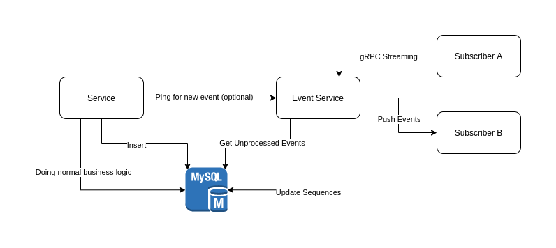

# Library for Transactional Outbox with total ordering
[](https://goreportcard.com/report/github.com/quangtung97/eventx)
[](http://gocover.io/github.com/quangtung97/eventx)

## How it works



It's required two services and one database:

* Core service with normal business logic (depicted as `Service`)
* A service for processing events, including serializing the order of events and publishing to other consumers (depicted
  as `Event Service`)

And the database has one table of the form:

```sql
CREATE TABLE `events`
(
    `id`         bigint unsigned NOT NULL AUTO_INCREMENT,
    `seq`        bigint unsigned DEFAULT NULL,
    `data`       mediumblob NOT NULL,
    `created_at` timestamp  NOT NULL DEFAULT CURRENT_TIMESTAMP,
    PRIMARY KEY (`id`),
    UNIQUE KEY `idx_events_seq` (`seq`)
);
```

In normal operation, the following steps will happen:

1. In one transaction, `Service` will doing normal business logic, using normal locking mechanism (pessimistic or
   optimistic) to prevent concurrent writes and then constructs and `Insert` an event to the database ( `seq` field
   is `NULL`).

2. After the transaction committed, the `Service` will ping (using http / grpc calls) the `Event Service` to check out
   the new events.

3. The `Event Service` will collect all the pings, performs a call to the database to get all unprocessed events
   with `seq` is `NULL` (with limiting).

4. The `Event Service` uses the last `seq` value stored on memory, set the `seq ` for each of event in the previous step
   in an incremental order. Then updates that sequence numbers to the database.

5. Other services / threads can listen for new events and using the sequence number to determine whether events already
   consumed (like `offsets` in partitions of Kafka).